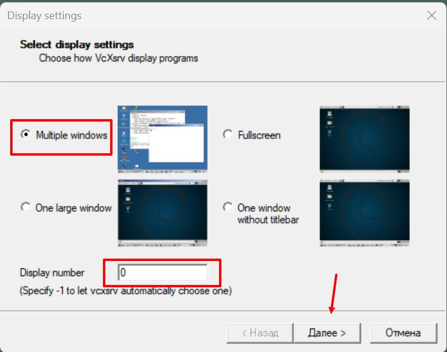
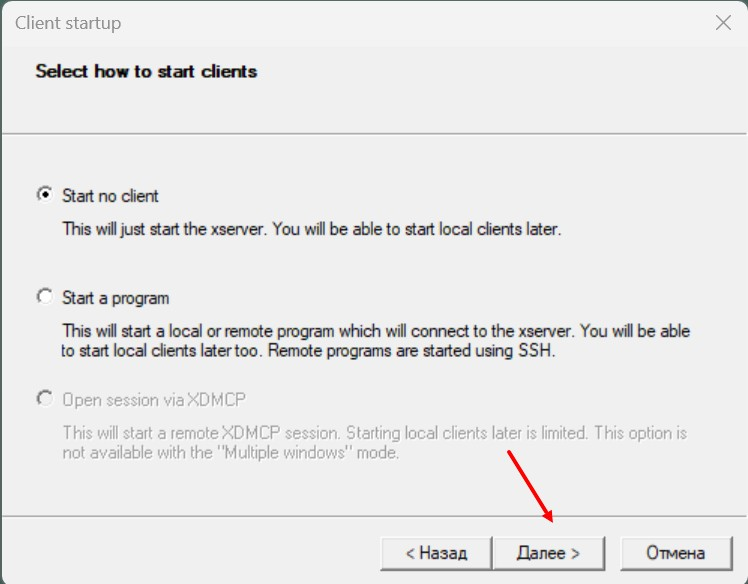
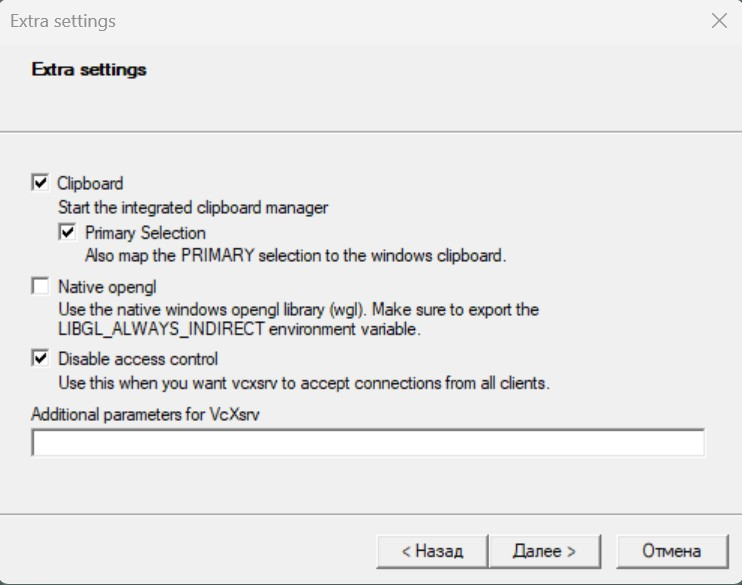
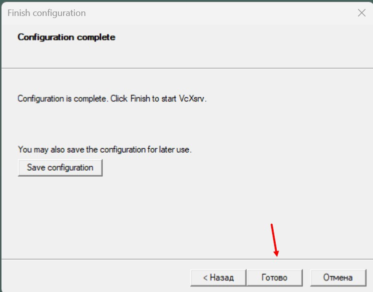

# ROS2 HUMBLE DOCKER GUI

This tutorial is designed as a basis for further projects written using the ROS framework. Here we create containers for quick and convenient work in them. Containers can be launched separately manually via Dockerfile or via docker-compose, depending on the preference and the necessary functionality. It also describes the settings for using GUI applications inside Docker.

## Final result
<video width="1280" height="600" controls>
  <source src="imgs/final.mp4" type="video/mp4">
</video>

## Pre-installation:
- Get Docker desktop installed and running by following this [Guide](https://docs.docker.com/desktop/install/windows-install/)
- Ensure WSL-2 is installed or upgraded from WSL-1 from this [link](https://learn.microsoft.com/en-us/windows/wsl/install)
- Install VcXsrv Windows X Server from this [link](https://sourceforge.net/projects/vcxsrv/)
## User gide docker-composer
Before starting the container, you need to configure and start the X server (VcXsrv). Using the VcXsrv its a simple approach to connect GUI in Docker container and localhost machine. You can learn more [here](https://wiki.ros.org/docker/Tutorials/Compose).

Detailed configuration of [ROS GUI](https://wiki.ros.org/docker/Tutorials/GUI) support. If you want more setting read [here](https://habr.com/ru/companies/stc_spb/articles/657927/).

 |  
 |  
### Run docker-compose (multiruning)
If you want to use docker-compose in your projects. Build containers.
```
docker-compose build
```
- Run containers.
```
docker-compose up
```
In order to use docker-compose tools correctly, you should study docker-compose.yml and also refer to the technical documentation.
In this repository, I used environment variables that are rendered in this file [.env](env/.env) . They are used when building containers, as well as when launching containers via docker-compose.

All the necessary dependencies for Python are placed in the requirements folder. There are 2 files in this folder  [common.txt](requirements/common.txt) this is a file with the main dependencies and [developmet.txt](requirements/developmet.txt) which contains files for debugging if necessary. This is done in order to use a container for production.

Useful source source of information [Github](https://github.com/HaiderAbasi/ROS2-Path-Planning-and-Maze-Solving/tree/master).

If such an error occurs, it means that an incorrect command was entered or such a module is not installed
```
/ros_entrypoint.sh: line 6: exec: rviz: not found
```
## User gide Dockerfile
- Running a container with GUI enabled for Windows
```
docker run -it --name <container name> -e DISPLAY=host.docker.internal:0.0  bin/bash

```


## Useful commands for containers
- Creating a interactive container  from image
```
docker run -it <image name>
```
- Giving Name to a container while creating
```
docker run --name <container name> <image name>
```
- Start a stopped Container
```
docker start (container_id)
```
- Connect shell to running container
```
docker exec -it (container_id) bin/bash
```
## Building Image from Docker File
- Terminal from same directory
```
docker built -t <image name > .
```